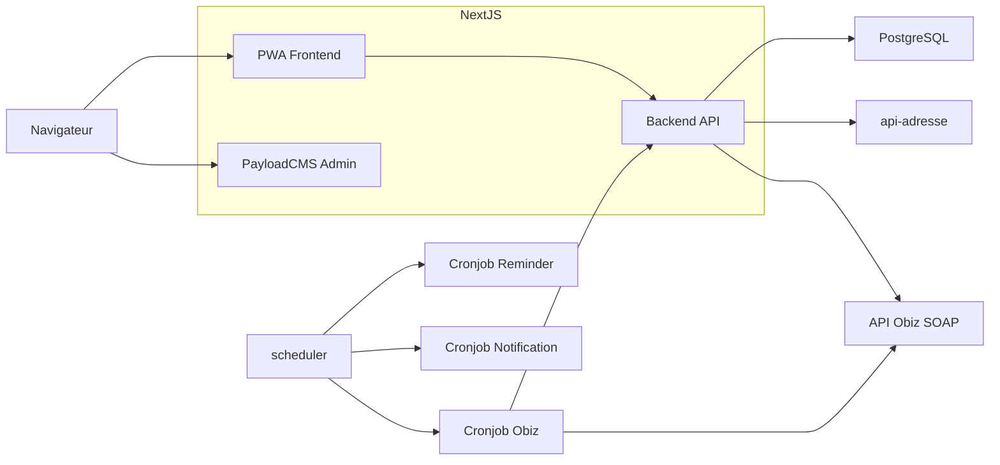

# Carte "jeune engagé"


## Description

Ce SI a pour vocation de démocratiser l'accès aux biens et services essentiels pour les jeunes de 18-25 ans, qu'ils soient étudiants ou non, via un système de réductions négociées avec des entreprises partenaires.

Il se compose d'une application PWA pour les utilisateurs et d'un back-office pour l'administration des offres et contenus.

Les fonctionnalités princiaples proposées aux utilisateurs sont :
- Inscription et accès vérifié selon le canal
  - Via le numéro de téléphone whitelisté par la mission locale du jeune
  - Via un widget déployé sur l'application du CEJ
- Consultation et réservation de codes promos à usages uniques
- Accès a des espaces de réductions dédiés mis à disposition par les entreprises engagées
- Achat de "bons d'achats remisés" via l'intégration de l'API partenaire Obiz
- Installation de l'application sur iOS/Android
- Réception de notifications personnalisées

Côté Back Office (PayloadCMS), il y a plusieurs modules, dont voici les principaux :
- Gestion des offres et partenaires
- Gestion des contenus
- Statistiques d'utilisation
- Administration des utilisateurs
- Construction de formulaires de satisfaction

## API externes

L'application fait appel aux apis extérieures suivantes :
- [api-adresse](https://adresse.data.gouv.fr/outils/api-doc/adresse)
- API Obiz (SOAP)

L'application se connecte également à un serveur SMTP pour l'envoi de mail.

## Architecture technique



## Technologies

- Next.js 13
- TypeScript
- next-pwa
- PayloadCMS

Pour la persistance des données, PayloadCMS utilise une base PostgreSQL.

## Cronjobs

Les tâches automatisées sont gérées via Kontinuous :

| Tâche | Horaire | Description |
|-------|---------|-------------|
| Obiz | 4h00 | Synchronisation catalogue offres |
| Reminder | Mercredi 17h30 | Envoi rappels email |
| Notification | 18h00 | Envoi notifications push |

## Developpement

### Services Docker
Le docker-compose lance :
- PostgreSQL : base de données principale
- MailDev : serveur SMTP de test accessible sur http://localhost:1080

```bash
docker compose up -d
```
### Installation racine
À la racine du projet, installez Husky pour le formatage de code en pre-commit :

```bash
yarn
yarn prepare
```

### Application NextJS
1. Rendez-vous dans le dossier webapp :
```bash
cd webapp
```

2. Copiez le fichier d'environnement :
```bash
cp .env.example .env
```

3. Installez les dépendances :
```bash
yarn
```

4. Générez les données de test :
```bash
yarn seed:dev
```

5. Lancez l'application (port 3000) :
```bash
yarn dev
```

### Comptes de test

Un accès admin à PayloadCMS et un référent sont créés dans les seed.

| Email | Type de compte | Mot de passe | URL Login |
| -------- | -------- | -------- | -------- |
| admin@test.loc | Administrateur | admin123 | /admin |
| referent@test.loc | Référent | referent123 | /supervisor |

### Variables d'environnement

Après avoir copié le `.env.example`, configurez manuellement ces services :

- **AWS S3** : stockage des fichiers
  - S3_ENDPOINT, S3_BUCKET_NAME, S3_REGION, S3_ACCESS_KEY_ID, S3_SECRET_ACCESS_KEY
- **Octopush** : envoi de SMS
  - OCTOPUSH_API_KEY, OCTOPUSH_API_LOGIN
- **API Obiz** : gestion des bons d'achat
  - OBIZ_SOAP_HOST, OBIZ_SOAP_URL, OBIZ_PARTNER_ID, OBIZ_SECRET
- **Matomo** : analytics (optionnel)
  - NEXT_PUBLIC_MATOMO_URL, NEXT_PUBLIC_MATOMO_SITE_ID
- **Crisp** : chat support (optionnel)
  - NEXT_PUBLIC_CRISP_TOKEN
- **SMTP** (production uniquement, MailDev en local)
  - SMTP_HOST, SMTP_PORT, SMTP_FROM_NAME, SMTP_FROM_ADDRESS
